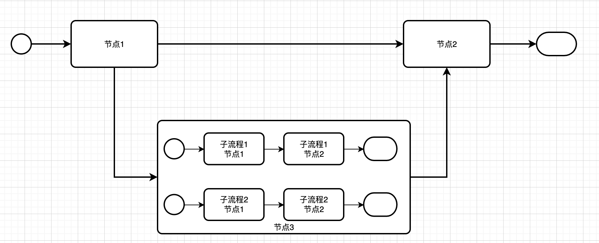
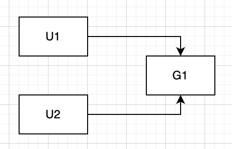

流程引擎的建模

根据流程引擎的生命周期将流程分为：
1. 流程定义 `WorkFlowDefinition`, 流程定义又拆分为：流程节点定义 `WorkFlowNodeDefinition` ， 流程连线定义 `WorkFlowLinkDefinition`
2. 流程实例 `WorkFlowInstance`，流程实例又拆分为：流程节点 `WorkFlowNode`，流程任务 `WorkFlowTask`。

模型说明：
1. 流程定义主要承载流程中各个元素的配置描述，节点定义主要描述节点类型，节点的相关配置，连线定义主要描述节点的流转路径以及条件。
2. 流程实例主要承载流程的运行时状态以及相关配置数据，一个流程节点对应一到多个流程任务，包括：子流程，流程节点的状态取决于流程任务的状态。

关于包含，并行网关的说明：
节点流转的方向如果可以往回流转的话，那么在包含，并行网关的分支上如果流转出现往回的情况，尤其出现往回流转至分支之前，整体流程引擎的行为就变得不太可控，直观。在使用的过程中需要频繁的说明，因此这里将包含，并行网关改为支持嵌套并行的子流程。

另外，包含网关需要判断满足条件的分支全部完成，才能继续流转，因此，需要遍历流程图判断是否有其他满足条件的分支在执行，逻辑上性能较差。

基于以上的情况，这里考虑到复杂度，使用的方便程度，将包含，并行网关改为嵌套并行子流程，在子流程内部，每个并行流程为一个子流程。

原理图说明：

流程引擎的事务：
流程事务范围指：从一个等待节点开始到另外一个等待节点结束。等待节点是指节点任务需要满足一定条件才能够执行完成的节点，例如：用户节点，事件节点，汇聚节点。

使用长事务的原因： 
主要用来保证流程引擎的数据一致性，即流程引擎发生异常时，流程能够恢复到操作以前的状态，例如：服务宕机，数据库异常，其他隐式异常。

长事务的需要额外关注的问题：
1. 并行网关节点或者多用户任务节点，因为事务的隔离级别（一般是可重复读）导致并发情况下出现节点满足要条件依然无法继续流转。
   例如： 
   该场景下，可能发生U1，U2两个任务同时操作，此时，U1， U2分别处于两个不同的事务中，每个事务中都认为自己的第一个到达网关的接口，实际上两个任务都已完成，造成流程卡在网关节点无法继续流转。

   处理方式：通过乐观锁重试

2. 任务节点运行时间可能超过事务的超时时间，导致事务异常回滚，进而影响这个流程引擎的可用性，因此，需要额外关注多个任务型节点的执行时间是否超过事务超时时间
3. 依赖生命周期回调事件外部服务，在异常回滚时需要额外处理异常回调，完成业务回滚，保证整体逻辑上的一致性，如果不支持回滚，需要保持幂等，支持重复请求

短事务需要额外关注的问题：
1. 短事务需要重点处理服务宕机/发版重启的情况下，数据如何保持一致性，尤其对于并行网关而言，可能出现分支fork的过程中服务异常。
2. 短事务在并行网关并发join时，需要加锁保证只有一个线程能够在满足条件下继续流转，另外，在该场景下短事务如果回滚的话，会出现并行网关未满足条件，但是流程继续往下流转了。
3. 采用短事务方案时，最好采用重试的方式，保证流程数据的一致性，而不是回滚，因为考虑到第2点，回滚后数据不一致

分布式环境下流程引擎的问题：
1. 分布式系统的数据一致性

